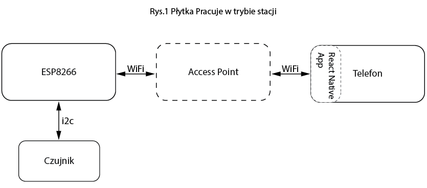
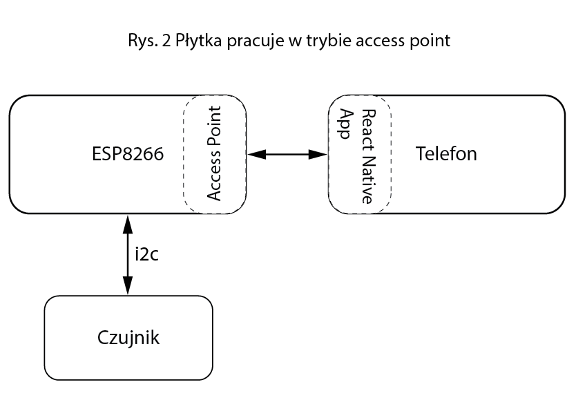

# weather-station
## Operating Modes

<p float="left">
  
   
</p>

## Mobile App

### Development


The mobile app is built with ReactNative and Expo. To persist high level of compability it's also wrapped with docker, so the only software-related requirement to start working on a project is to have docker runtime installed. Instructions how to install docker are [here](https://docs.docker.com/get-docker/). 
Once docker is installed, development environment can launched, however some additional steps should be taken:
- install ExpoGo app on a mobile device
- set up ip address for Expo
    - obtain your local ip address with `ifconfig` or `ipconfig`
    - create file `.env.dev` in a project's root directory
    - add following line to the created file `REACT_NATIVE_PACKAGER_HOSTNAME=<your-local-ip>`
- launch environment with `docker compose up --build`
- scan QR code generated in terminal or go to Expo console - `http://<your-local-ip->:19000` 
- develop & debug, all changes made to source code will be sent to mobile device seamlessly - no need to reload project manually 🔥
- to stop environment, simply press `ctrl+c` in a terminal windows running `docker compose`

**NOTE-1:** Since `.env.dev` file contains informations related to certain local environment, it should never be commited.

**NOTE-2:** Once everything's installed, it's enough to run `docker compose up` to start working on a project, however, in case of any problems, check whether your local ip address hasn't change.

**NOTE-3:** If you want to test mobile app, please type in `htttp://date.jsontest.com` address in the input field as for now it is hardcoded to fetch only one type of json key.
### Installing packages
All packages should be installed with `expo install <package>`, but since project is runned with docker, package installation should be conducted inside container. Follow these steps to install package:
- get into running container: `docker exec -it ws-mobile-app bash`
- install package with: `expo install <package>`
- optionally - type `exit` to leave container

**NOTE-1:** Packages can be also installed without getting inside running container, however, in such case, compatible version of `node`, `npm` and `expo-cli` have to be installed locally. Then `expo install <package>` can be runned directly inside `<project-path>/mobile/` directory. 

**NOTE-2:** In order to remove package, `npm uninstall <package>` should be runned since expo-cli doesn't have `uninstall` command. In fact expo-cli is just a wrapper for underlying npm, which ensures packages compatibility in case of installation.

### Troubleshooting

In case of any problems it's sometimes easier to declutter docker than do anything else. To do so, run following commands:
```bash
docker kill $(docker ps -q)     # kill all the running containers
docker rm $(docker ps -q -a)    # remove all the containers
docker volume prune -f          # remove all the volumes
docker system prune -f          # prune system - caches etc.
```

**NOTE:** Beware that above commands applies to whole docker runtime, not only this particular project. It shouldn't be a problem in development environments tho. 

## Embedded

### Environment configuration

Shell scripts used for erasing/flashing and uploading software make use of `pipenv` and libraries stored in `requirements.txt` file, instructions how to install `pipenv` can be found [here](https://pipenv.pypa.io/en/latest/).

Once pipenv is installed on a machine, change directory to `embedded` and initialize environment with 
```bash
cd embedded
pipenv install -r requirements.txt
```

Then, supplement (or create) file called `.env.dev` and put there two variables `ESP_PORT` and `ESP_BAUD` - 115200 by default. Port needs to be determined manually by typing `ls -al /dev | grep usb` on *nix systems or searching device manager on windows.

### Flashing micropython to new ESP8266
Assuming there is no `micropython` binary flashed on `ESP8266`, it can be flashed with
```bash
cd embedded/utils
bash erase-flash.sh
bash flash-firmware.sh
```
 This step is not necessary if micropython have been flashed already.

### Uploading python scripts
Source code for weather station are listed in `/embedded/src`, those scripts can be uploaded to ESP with `/embedded/utils/upload-software.sh` script. 
```bash
cd embedded/utils
bash upload-software.sh
```
Source files have following meaning:
- `bme.py` - library that wraps up communication with BME280 sensor
- `boot.py` - script that setups ESP board on boot
- `main.py` - script that is executed right after boot, all variables initialized in `boot.py` are accessible here

### Screening micropython REPL

On *nix systems micropython REPL can be accessed with `screen` command:
```bash
screen <port> <baud>
```

On windows systems REPL can be accessed with Putty or similar utility.
